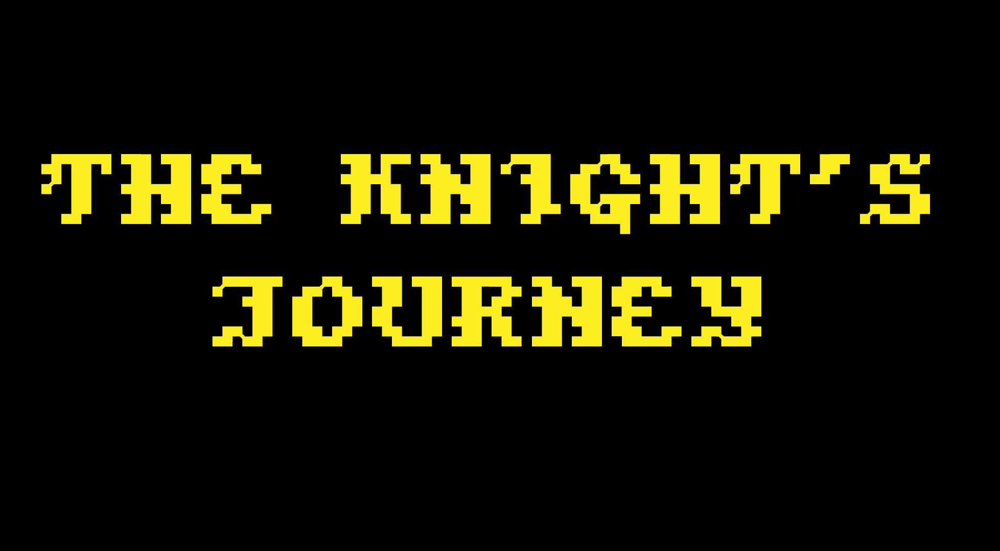

## The Knight's Journey - Videogame

I am pleased to present you my final project degree, an adventure game that I have developed and that I am now willing to share with the community.

## Table of contents

* [Gameplay](#gameplay)
* [Installation](#installation)
* [Controls](#controls)
* [Screenshots](#screenshots)
* [Contributing](#contributing)

## Gameplay

In this game, you will embark on an exciting adventure through a fantastic world full of challenges and mystery. Your goal is to explore this world, interact with its inhabitants and discover the secrets it hides. Along the way, you will face difficult monsters and two final bosses.

I do not rule out further developing the game to improve these parts where the game is worse.

Any feedback will be appreciated and used to improve and further develop the game.

Thank you for taking the time to read this introduction, and I hope you enjoy playing my adventure game as much as I enjoyed creating it.

## Installation

1. Download the game from the folder The-Knight-s-Journey-Videgame. Depending on your operating system, download it for macOS or Windows.
2. Run the game.
3. Enjoy it!

## Controls
| asdf	|asd	|ads	| 
|asd|asd|dsfd|

## Screenshots

## Contributing

I would like to thank and mention all the free resources I have been able to use in this project.

[Luizmelo](https://luizmelo.itch.io/monsters-creatures-fantasy) - Monsters creatures fantasy
